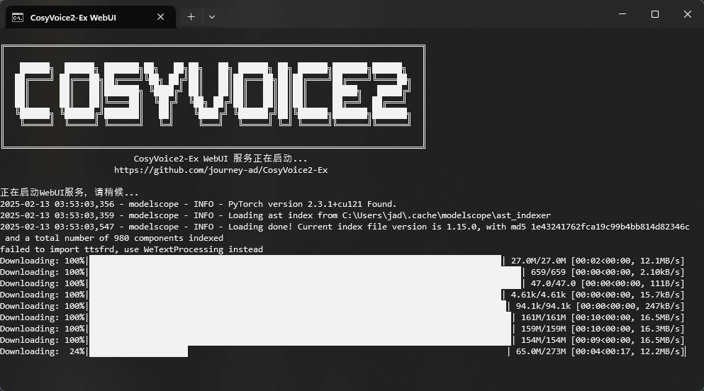

# CosyVoice2
CosyVoice2（预训练音色/3s极速复刻/自然语言控制/自动识别/音色保存/API）

## 启动

> [!NOTE]
> 首次运行会自动下载约 10G 左右的模型文件，也可以[自行下载模型文件](https://www.modelscope.cn/models/iic/CosyVoice2-0.5B)，放置于 `pretrained_models` 目录下

### Windows

提供有 Windows 可用的一键包，解压后双击打开 `运行-CosyVoice2-Ex.bat` 即可运行

[>>> 点击下载 <<<](https://github.com/journey-ad/CosyVoice2-Ex/releases/latest)

<p>
  
</p>

### Linux & macOS

在 MacBook Pro(M4 Pro) 和 WSL2 Ubuntu 22.04 部署运行测试通过

须通过 conda 环境运行，参考 https://docs.conda.io/en/latest/miniconda.html

```sh
conda create -n cosyvoice -y python=3.10
conda activate cosyvoice
conda install -y -c conda-forge pynini==2.1.5
pip install -r requirements.txt -i https://mirrors.aliyun.com/pypi/simple/ --trusted-host=mirrors.aliyun.com

python webui.py --port 8080 --open
```

Linux 可安装 `ttsfrd` 提升文本归一化性能（可选）

```sh
sudo apt-get install -y git build-essential curl wget ffmpeg unzip git git-lfs sox libsox-dev nvidia-cuda-toolkit

git lfs install
git clone https://www.modelscope.cn/iic/CosyVoice-ttsfrd.git pretrained_models/CosyVoice-ttsfrd

cd pretrained_models/CosyVoice-ttsfrd/
unzip resource.zip -d .
pip install ttsfrd-0.3.6-cp38-cp38-linux_x86_64.whl
```

## 接口地址

CosyVoice2-Ex 提供基于 FastAPI 的高性能 TTS API 服务：

```sh
# 启动 API 服务
python run-api.py  # 默认端口9880

# 访问示例
http://localhost:9880/tts?text=春日清晨，老街深处飘来阵阵豆香。三代传承的手艺，将金黄的豆浆熬制成最纯粹的味道。一碗温热的豆腐脑，不仅是早餐，更是儿时难忘的记忆，是岁月沉淀的生活智慧。&speaker=舌尖上的中国

http://localhost:9880/tts?text=hello%20hello~%20[breath]%20听得到吗？%20きこえていますか？%20初次见面，请多关照呀！%20这里是嘉然Diana，大家也可以叫我<strong>蒂娜</strong>%20是你们最甜甜甜的小草莓&speaker=嘉然&instruct=慢速，用可爱的语气说
```

### API 功能

- **文本转语音**
  - GET: `/tts?text=文本内容&speaker=音色ID&instruct=指令&streaming=0&speed=1.0`
  - POST: `/tts` (JSON请求体)

- **获取音色列表**
  - GET: `/speakers`

- **健康检查**
  - GET: `/health`

### API 文档

访问 `http://localhost:9880/docs` 获取交互式 API 文档。

### 认证说明

默认启用 API 认证。请在请求头中添加 `X-API-Key` 字段，使用有效的 API 密钥。
默认可用的 API 密钥为 `cosyvoice-api-demo`。

可以通过设置环境变量禁用认证：
```bash
export ENABLE_API_AUTH=False
```

更多详细说明请参考 [API 文档](api/README.md)。
